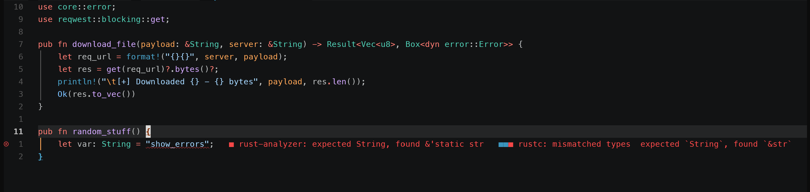

# dark2026.nvim

A Neovim port of VS Code's **Dark 2026** look — built from the official Dark Modern 2026 theme JSON.



- Dark Modern 2026 UI palette (deep `#121314` editor, `#191a1b` chrome, cyan-blue `#3994bc` accent)
- GitHub-Dark-style syntax: **red keywords**, **purple functions**, teal-green types, light-blue constants, soft-blue macros
- Treesitter, LSP semantic tokens, diagnostics, diff, gitsigns
- Plugin highlights: blink.cmp, telescope, snacks.picker, bufferline, which-key

## Install

### lazy.nvim

```lua
{
  'D0nw0r/dark2026.nvim',
  lazy = false,
  priority = 1000,
  config = function()
    vim.cmd.colorscheme 'dark2026'
  end,
}
```

### packer.nvim

```lua
use 'D0nw0r/dark2026.nvim'
```

Then `:colorscheme dark2026`.

## Palette

| Role | Hex | Notes |
|---|---|---|
| editor bg | `#121314` | |
| chrome bg | `#191a1b` | sidebar, status, panel, inactive tabs |
| menu bg | `#202122` | |
| accent | `#3994bc` | cyan-blue |
| keyword | `#FF7B72` | red — `if`, `for`, `return`, `use` |
| function | `#D2A8FF` | purple |
| type | `#4EC9B0` | teal-green — also used for modules |
| constant | `#79C0FF` | light blue — enum members, numbers, booleans |
| macro | `#48a0c7` | darker blue — `println!`, `sc!` |
| string | `#A5D6FF` | |
| escape / `{}` | `#FF7B72` | red |
| comment | `#8B949E` | gray-blue, italic |
| param / decorator | `#FFA657` | orange |
| tag (HTML) | `#7EE787` | |

## License

MIT — see `LICENSE`.
